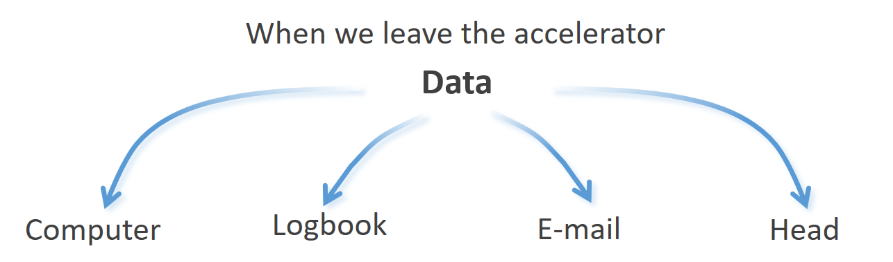
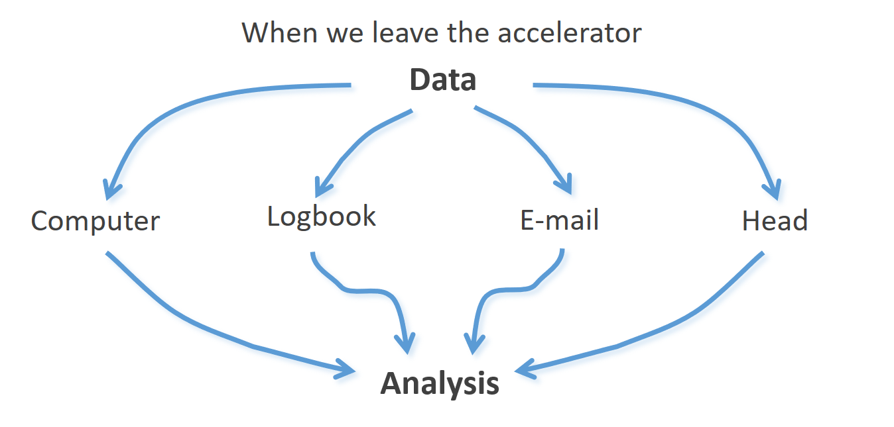
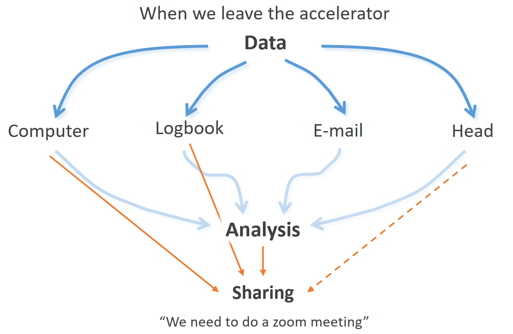
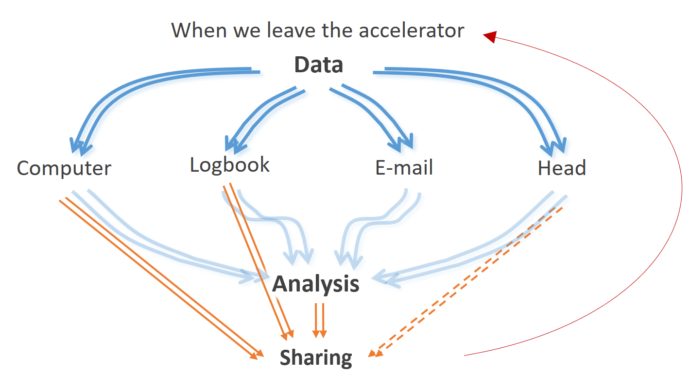
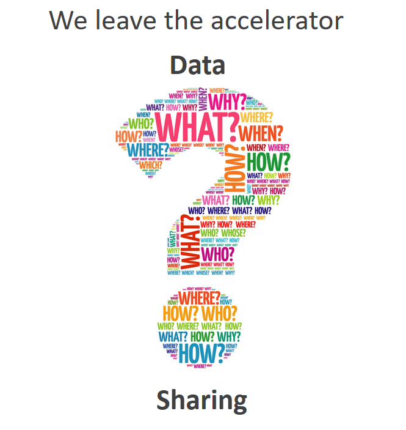
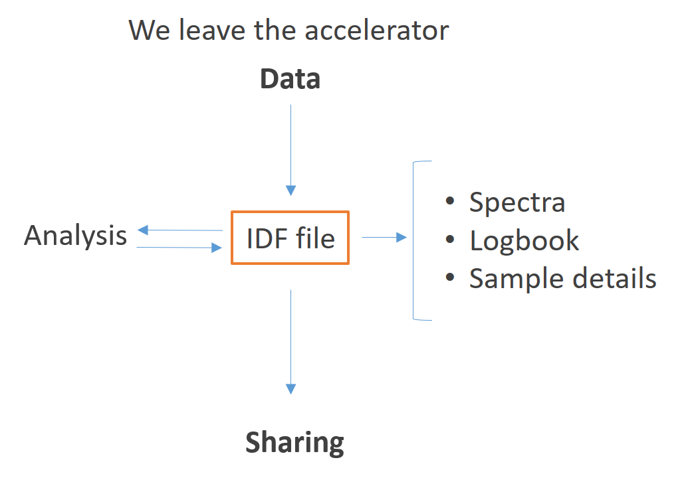

Why adopt a standardised format?
================================

As of now, when an ion beam scientist leaves the measurement station, he is forced to carry the data associated with the experiment in several formats and mediums:

* the spectra data is likely stored on some type of hardware or cloud storage;
* the experimental details are written on a paper notebook (sometimes in a digital one)
* other details, such as those related to the sample or the type of measurements already made, are often stored in a series of e-mails;
* information on how to link the above three points, and that extra bit of "not so important" information, is commonly trusted in each one's memory.

Afterwards, the ion beam scientist goes to his desk to analyse what he just did. The first step should be to gather all the information and format it into some specific analysis method. This can be harder than it looks, in particular, if a considerable time has passed between the experiment and the analysis. Among the issues one might face, the more prominent are likely:

* knowing  where the files were stored;
* remembering in which entry and in what logbook concerns the experiment;
* doing some "e-mail archaeology" (to quote a veteran Ion Beam Scientist);
* asking why we thought the above data storage locations would never be forgotten.

After battling the above issues, it is time to share the work. The scientist should compile, in the smaller number of files possible, the experimental process and raw data, the analysis methods and outputs and, ideally, the considerations taken in every step. This is perhaps where the current workflow fails the most. Since there is no agreed method to compile this, confusion is frequently set between collaborative groups leading to an eventual loss of information. To avoid this, the careful scientist will write long reports or e-mails that may not be definitive. Alternatively, group members exchange numerous e-mails or schedule zoom meetings. Either method takes an ever-increasing amount of time and energy and leaves one of the most important scientific principles unchecked - the results are hardly reproducible or will at least take as much effort as the initial try.

After substantial sharing and consequent feedback, either by collaborative groups or through the peer-reviewer process, a return to the accelerator is frequently needed. This return multiplicates all of the issues described until now, as illustrated in the figure below. The data files, the logbook entries, the number of e-mails and the kB stored in our memory all increase with each loop of acquisition-share. The complexity can rapidly become chaotic ("an order yet undeciphered") when the person returning to the accelerator is not the original one (as usually happens in groups with students).

.. .. figure:: images/actual_state_4.PNG
..    :width: 600

At this point, serious loss of information may incur. The what, why, who, when and how behind each experiment can easily be "lost in translation". At best, this slows the scientific process. At worst, it leads to wrong conclusions.

Therefore, a change in the management of data is urgently needed in the IBA community. In this context, the IDF (IBA Data Format) has been accepted by the `RADIATE EU Project <https://www.ionbeamcenters.eu/radiate/>`_ members as the standardised data format for IBA.

Instead of having information scattered through multiple locations, we leave the accelerator with a single IDF file. This file contains the spectra produced during the experiment, the experimental parameters of each measurement, the sample details and any event that might have occurred. 
  
When the analysis task arrives, the IDF file should be directly accepted by the analysis tools, both on the input and output sides of the codes. This means that not only the outputs but also the analysis methods and considerations are saved in the same IDF file.

When sharing, the scientist only has one single file to send. This is an obvious advantage and simplifies greatly the entire sharing feedback loop. The analysis can be readily reproduced either using the same analysis code or another one (and saved on the same file). Furthermore, returning to the accelerator will not increase the complexity in the same manner as described above. Any new data produced can be saved in the original file using the same standarised method. 

In summa, the entire workflow can be greatly expedited.